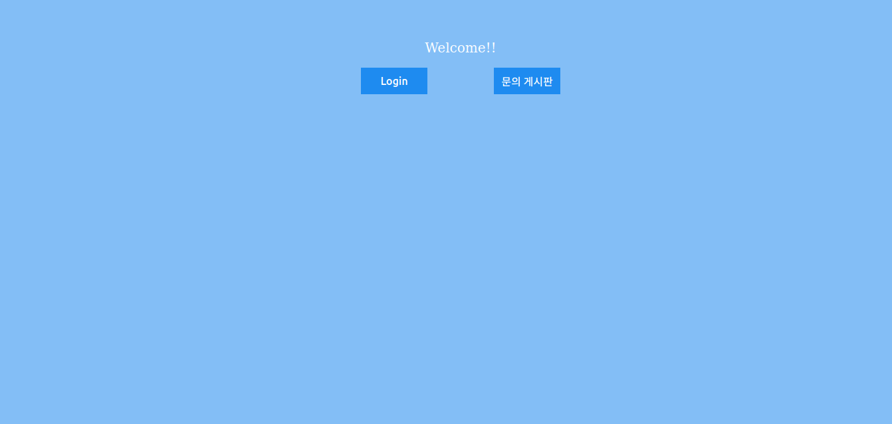
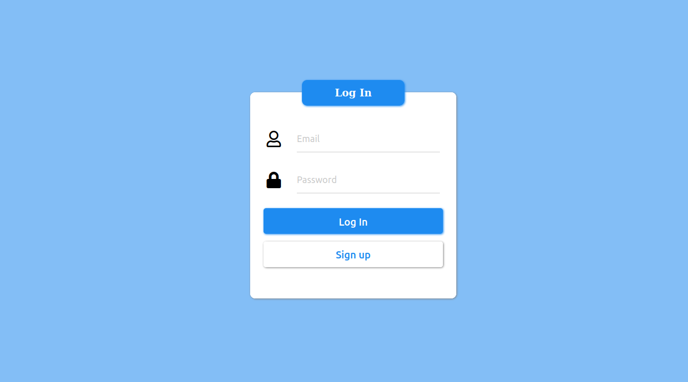
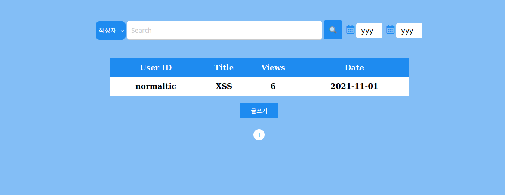
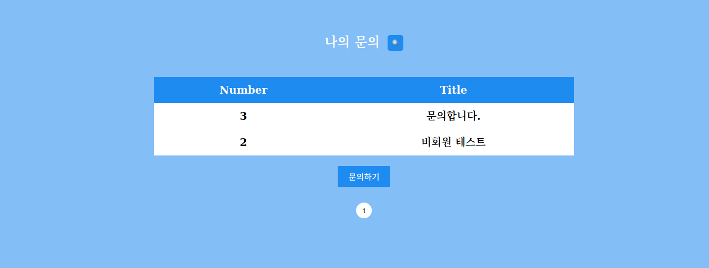
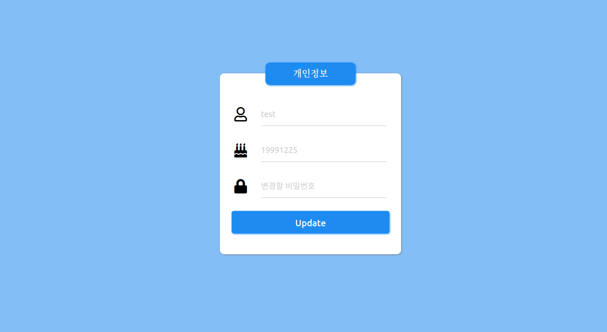

# Web Security

## First Page

## Login Page

## SignUp Page

## Main Page

## Board Page

## QnA Page

## MyPage

## Address Search Page

# Web Secure Coding
I found vulnerability of SQL Injection, XSS, CSFR, File Upload, File Download, Authentication, Authorization. 
For each weakness, I performed web secure coding. 
Detailed progress can be found at the following URL : https://hanuscrypto.tistory.com/