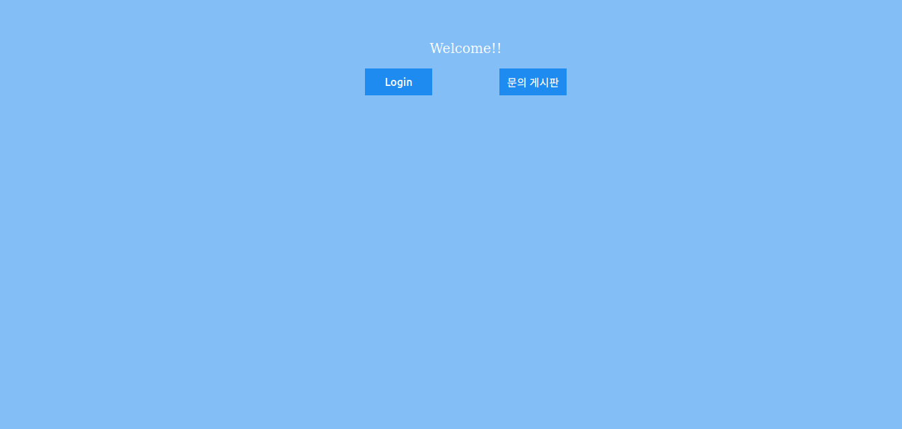
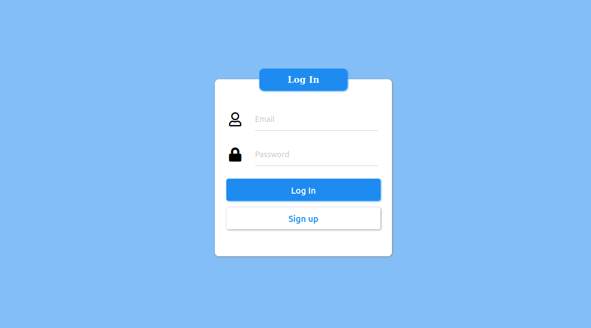
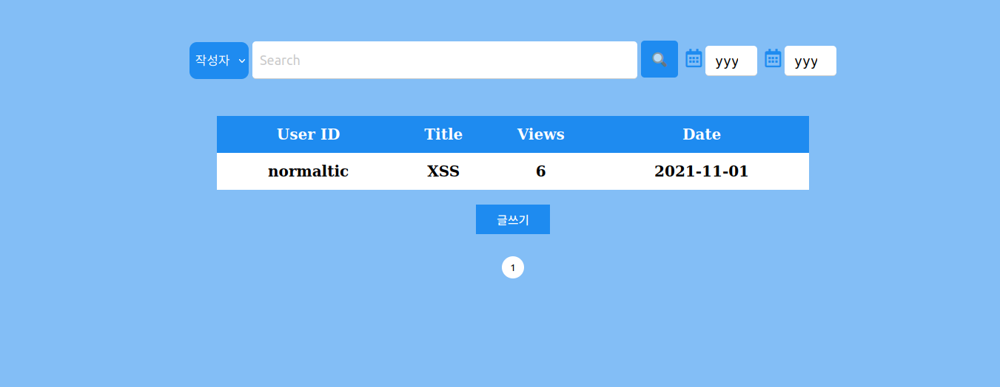
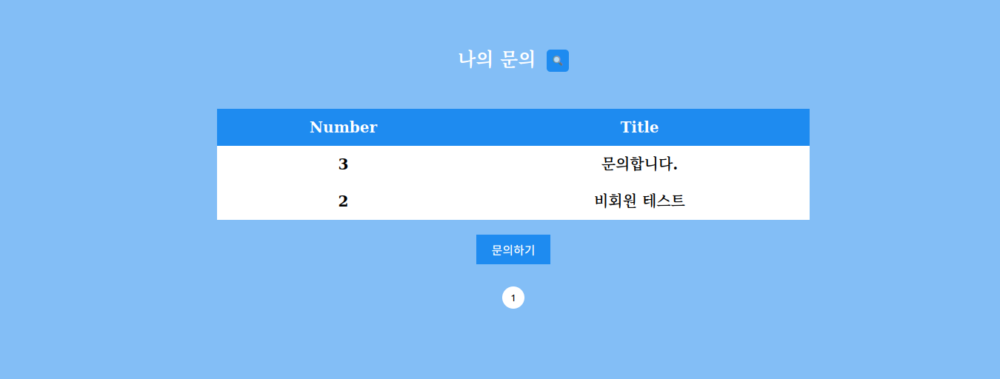
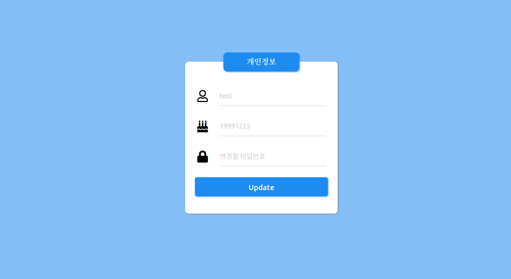

# Web Security Portfolio

> PHP 웹 애플리케이션을 **직접 개발**하고, 취약점을 **공격**한 뒤, **시큐어 코딩**으로 방어까지 수행한 end-to-end 웹 보안 프로젝트입니다.

## 프로젝트 개요

"개발할 줄 알아야 뚫을 수 있고, 뚫어봐야 막을 수 있다"는 관점에서 진행했습니다.

```
1_vulnerable-app  →  2_exploits  →  3_secure-app  →  4_pentest-reports
  취약한 앱 개발      공격 & PoC     시큐어 코딩         모의해킹 보고서
```

**Tech Stack**: PHP · MySQL · HTML · CSS  
**Tools**: Burp Suite · curl  
**Reference**: OWASP Top 10 · KISA 웹 취약점 진단 기준

---

## 1_vulnerable-app — 취약한 PHP 웹 애플리케이션

보안 학습 목적으로 의도적으로 취약하게 개발한 실습 환경입니다.  
로그인, 게시판, QnA, 파일 업로드, 마이페이지 기능을 포함합니다.







**포함된 취약점 (의도적)**

| 취약점 | 위치 |
|---|---|
| SQL Injection | `auth/login.php`, `mypage/mypage_update.php`, `board/board.php` |
| XSS (Stored) | `board/board_create.php` |
| CSRF | `mypage/mypage_update.php`, `index.php` |
| File Upload (웹쉘) | `board/board_create.php` |
| 불충분한 인증 | `board/read.php`, `board/update.php` |
| 불충분한 인가 | `board/board_update.php` |
| Likes IDOR | `board/likes.php` |
| 세션 종료 미흡 | `index.php`, `auth/cookie.php` |

→ [`1_vulnerable-app/`](1_vulnerable-app/)

---

## 2_exploits — 공격 PoC & Writeup

`1_vulnerable-app`에 포함된 취약점들을 실제로 분석하고 공격한 기록입니다.  
각 writeup은 **취약한 코드 → 공격 원리 → PoC → 영향도** 순으로 작성했습니다.

| 취약점 | OWASP | writeup |
|---|---|---|
| SQL Injection (인증우회 5패턴 + 데이터 탈취 + mypage 변조) | A03:2021 | [writeup](2_exploits/sql-injection/writeup.md) |
| XSS + 세션탈취 + 키로거 연계 | A03:2021 | [writeup](2_exploits/xss/writeup.md) |
| CSRF | A01:2021 | [writeup](2_exploits/csrf/writeup.md) |
| File Upload (웹쉘) | A04:2021 | [writeup](2_exploits/file-upload/writeup.md) |
| 인증/인가 미흡 + 세션 종료 미흡 | A07:2021 | [writeup](2_exploits/auth-bypass/writeup.md) |
| Likes 파라미터 조작 (IDOR) | A01:2021 | [writeup](2_exploits/likes-idor/writeup.md) |

→ [`2_exploits/`](2_exploits/)

---

## 3_secure-app — 시큐어 코딩 적용 버전

`1_vulnerable-app`을 베이스로 발견된 취약점을 모두 패치한 버전입니다.  
패치 내용과 변경 이유는 diff 형태로 정리했습니다.

| 방어 기법 | 적용 대상 | 막는 취약점 |
|---|---|---|
| Prepared Statement | `login.php`, `board_create.php`, `mypage_update.php` 外 | SQL Injection |
| htmlentities(ENT_QUOTES) | `read.php`, `board.php`, `qna_read.php` | XSS |
| CSRF 토큰 | `index.php`, `board_create.php`, `mypage_update.php` | CSRF |
| 확장자 + MIME 화이트리스트 | `board_create.php`, `board_update.php` | File Upload |
| 작성자 검증 (AND username=?) | `board_update.php` | 인가 미흡 |
| $_SESSION['id'] 사용 | `likes.php` | IDOR |
| session_destroy() + 쿠키 만료 | `index.php`, `auth/cookie.php` | 세션 종료 미흡 |
| session_regenerate_id() | `login.php` | 세션 고정 공격 |
| 로그인 실패 횟수 제한 | `login.php` | 브루트포스 |

→ [`3_secure-app/`](3_secure-app/) · 패치 상세: [`3_secure-app/README.md`](3_secure-app/README.md)

---

## 4_pentest-reports — 모의해킹 보고서

| 보고서 | 대상 | 기간 | 발견 취약점 |
|---|---|---|---|
| [커뮤니티 B](4_pentest-reports/Pentest_Report_CommunityB.pdf) | normaltic.com:5004 | 2022.01.21 ~ 01.26 | **10개** |
| [커뮤니티 C](4_pentest-reports/Pentest_Report_CommunityC.pdf) | normaltic.com:5004 | 2022.01.28 ~ 02.02 | **12개** |
| [커뮤니티 D](4_pentest-reports/Pentest_Report_CommunityD.pdf) | normaltic.com:5002 | 2022.02.04 ~ 02.08 | **12개** |

→ [`4_pentest-reports/`](4_pentest-reports/)

| 연구 보고서 | 내용 |
|---|---|
| [SQL Injection 연구](2_exploits/sql-injection/SQL_Injection_Attack_Research.pdf) | 인증우회 5패턴, Union / Error-based / Blind SQLi 전 유형 |
| [XSS 공격 연구](2_exploits/xss/XSS_Attack_Research.pdf) | Stored / Reflected / DOM XSS, 세션탈취 · 키로거 · HTML Injection |

→ [`2_exploits/`](2_exploits/)

---

## 기술 블로그

실습 과정 상세 기록 (87개 포스트) → **https://hanuscrypto.tistory.com**

- [웹 해킹 이론](https://hanuscrypto.tistory.com/category/WEB%20HACKING/%EC%9B%B9%20%ED%95%B4%ED%82%B9%5B%EC%9D%B4%EB%A1%A0%5D)
- [웹 해킹 실습](https://hanuscrypto.tistory.com/category/WEB%20HACKING/%EC%9B%B9%20%ED%95%B4%ED%82%B9%5B%EC%8B%A4%EC%8A%B5%5D)
- [앱 해킹](https://hanuscrypto.tistory.com/category/APP%20HACKING)
- [Wargames](https://hanuscrypto.tistory.com/category/WarGames)

---

> ⚠️ 이 레포지토리의 모든 공격 코드와 PoC는 **본인이 직접 구축한 실습 환경**에서만 사용되었습니다.